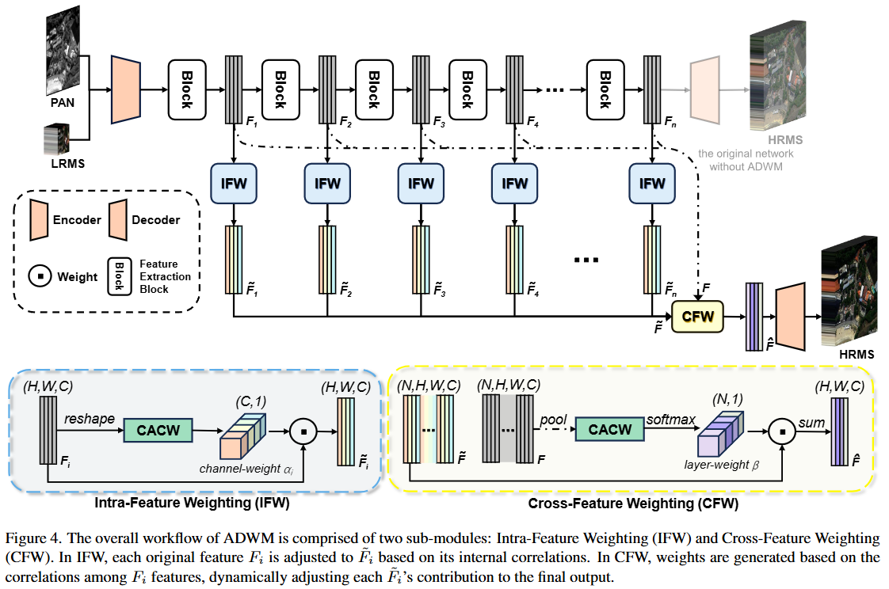

# A General Adaptive Dual-level Weighting Mechanism for Remote Sensing Pansharpening [CVPR 2025]

<div style="text-align: center;">
  <a href="https://www.arxiv.org/">
    
  </a>
    <a href="https://arxiv.org/pdf/2503.13214">Arxiv</a>
    <!-- 
    <a href="https://openreview.net/pdf?id=QMVydwvrx7">NeurIPS 2024 -->
</div> 
<p style="text-align: center; font-family: 'Times New Roman';">
  </a>
    Abstract:
    Currently, deep learning-based methods for remote sensing pansharpening have advanced rapidly. However, many existing methods struggle to fully leverage feature heterogeneity and redundancy, thereby limiting their effectiveness. 
We use the covariance matrix to model the feature heterogeneity and redundancy and propose Correlation-Aware Covariance Weighting (CACW) to adjust them. CACW captures these correlations through the covariance matrix, which is then processed by a nonlinear function to generate weights for adjustment. Building upon CACW, we introduce a general adaptive dual-level weighting mechanism (ADWM) to address these challenges from two key perspectives, enhancing a wide range of existing deep-learning methods. First, Intra-Feature Weighting (IFW) evaluates correlations among channels within each feature to reduce redundancy and enhance unique information. Second, Cross-Feature Weighting (CFW) adjusts contributions across layers based on inter-layer correlations, refining the final output. Extensive experiments demonstrate the superior performance of ADWM compared to recent state-of-the-art (SOTA) methods. Furthermore, we validate the effectiveness of our approach through generality experiments, redundancy visualization, comparison experiments, key variables and complexity analysis, and ablation studies.
</a>
</p>

News:
<!-- ```- 2025/2/7：**Code RELEASED!**:fire: ``` -->

- 2025/3/12: **Code will be released soon!**:fire: 

## Quick Overview

The code in this repo supports Pansharpening.

<center>


</center>

# Instructions

## Dataset

In this office repo, you can find the Pansharpening dataset of [WV3, GF2, QB and WV2](https://github.com/liangjiandeng/PanCollection).


## Convenient Access to Results and Support for Beginners

If you need to use our methods as a benchmark, there is no need to retrain the models yourself. For your convenience, we can send you the complete mat files for WV3, GF2, QB, and WV2. In addition, to better support beginners, we can provide you with the source PowerPoint files containing plots from multiple papers we have collected, as well as a comprehensive writing guide.
Due to file size limitations and data security considerations, please contact us via email (jayhuang303hh@gmail.com) if you need these resources.


## Citation

If you find our paper useful, please consider citing the following:
@article{huang2025general,
  title={A General Adaptive Dual-level Weighting Mechanism for Remote Sensing Pansharpening},
  author={Huang, Jie and Chen, Haorui and Ren, Jiaxuan and Peng, Siran and Deng, Liangjian},
  journal={arXiv preprint arXiv:2503.13214},
  year={2025}
}

